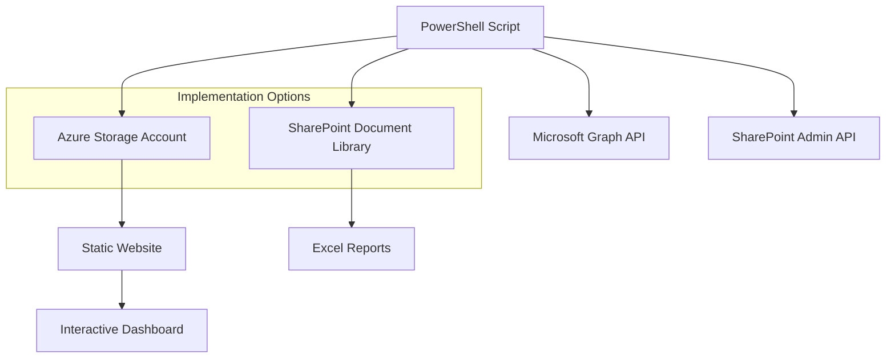

# SharePoint Download Monitoring Solution

A comprehensive solution for monitoring SharePoint Online document downloads with two implementation options: Azure Storage with interactive dashboard or traditional SharePoint Excel reports.

## 🚀 Quick Deploy to Azure

Deploy the complete Azure Storage solution with one click:

[](https://portal.azure.com/#create/Microsoft.Template/uri/https%3A%2F%2Fraw.githubusercontent.com%2FOfirGavish%2FSharePoint-Download-Report-Automation%2Fmain%2Fdeployment%2Fazuredeploy.json)

This will create:
- ✅ Azure Storage Account with static website hosting
- ✅ Pre-configured CORS settings for browser access
- ✅ Interactive dashboard files automatically deployed
- ✅ Secure blob containers for data storage

## 📊 Features

### Modern Azure Storage Solution
- **Interactive Web Dashboard** - Real-time visualizations with Chart.js
- **Responsive Design** - Works on desktop, tablet, and mobile
- **Dark Mode Support** - Modern UI with theme switching
- **Advanced Filtering** - Filter by date, user, site, file type
- **Data Export** - Export filtered results to CSV
- **Live Updates** - Automatic refresh capabilities
- **No Module Dependencies** - Uses latest PowerShell modules

### Traditional SharePoint Solution
- **Excel Reports** - Familiar spreadsheet format
- **SharePoint Integration** - Direct upload to document library
- **Scheduled Execution** - Automated report generation
- **Version Compatibility** - Tested with specific module versions

## 🏗️ Architecture



## 🛠️ Implementation Options

### Option 1: Azure Storage + Interactive Dashboard (Recommended)

**Advantages:**
- ✅ Modern interactive web interface
- ✅ Real-time data visualization
- ✅ Mobile-friendly responsive design
- ✅ Advanced filtering and search
- ✅ No SharePoint storage limitations
- ✅ Uses latest PowerShell modules
- ✅ One-click Azure deployment

**Use Case:** Organizations wanting modern analytics and visualization capabilities.

### Option 2: SharePoint Upload + Excel Reports

**Advantages:**
- ✅ Familiar Excel format
- ✅ Native SharePoint integration
- ✅ Easy sharing within organization
- ✅ Offline analysis capabilities

**Use Case:** Organizations preferring traditional reporting methods.

## 📋 Prerequisites

### Common Requirements
- ✅ SharePoint Online Administrator permissions
- ✅ Azure Active Directory Global Administrator or Application Administrator
- ✅ PowerShell 5.1 or PowerShell 7+
- ✅ Microsoft 365 tenant

### Azure Storage Solution
- ✅ Azure subscription with Contributor permissions
- ✅ Modern PowerShell modules (auto-updated)

### SharePoint Solution
- ✅ Specific PowerShell module versions:
  - ExchangeOnlineManagement 3.5.0
  - Microsoft.Graph.Authentication 2.25.0  
  - Az.Storage 6.0.0

## 🚀 Quick Start

### Azure Storage Deployment

1. **Deploy Infrastructure**
   ```powershell
   # Clone repository
   git clone https://github.com/OfirGavish/SharePoint-Download-Report-Automation.git
   cd SharePoint-Download-Report-Automation
   
   # Deploy to Azure (or use Deploy to Azure button above)
   az deployment group create \
     --resource-group your-rg \
     --template-file deployment/azuredeploy.json \
     --parameters storageAccountName=yourmonitoring
   ```

2. **Configure and Run**
   ```powershell
   # Edit configuration in the script
   .\scripts\Monitor-SharePointDownloads-AzureStorage.ps1
   ```

3. **Access Dashboard**
   - Navigate to your storage account's static website URL
   - View real-time analytics and reports

### SharePoint Deployment

1. **Install Required Modules**
   ```powershell
   # Install specific versions for compatibility
   Install-Module ExchangeOnlineManagement -RequiredVersion 3.5.0
   Install-Module Microsoft.Graph.Authentication -RequiredVersion 2.25.0
   Install-Module Az.Storage -RequiredVersion 6.0.0
   ```

2. **Run Script**
   ```powershell
   .\scripts\Monitor-SharePointDownloads-SharePointUpload.ps1
   ```

## 📁 Repository Structure

```
SharePoint-Download-Report-Automation/
├── 📄 README.md                           # This file
├── 📄 .github/copilot-instructions.md     # Development guidelines
├── 📁 scripts/                            # PowerShell automation
│   ├── Monitor-SharePointDownloads-AzureStorage.ps1
│   └── Monitor-SharePointDownloads-SharePointUpload.ps1
├── 📁 dashboard/                           # Interactive web dashboard
│   ├── index.html                          # Dashboard HTML structure
│   ├── dashboard.css                       # Responsive styling
│   └── dashboard.js                        # Interactive functionality
├── 📁 deployment/                          # Azure deployment templates
│   ├── azuredeploy.json                    # ARM template
│   └── azuredeploy.parameters.json         # Parameters template
└── 📁 docs/                               # Documentation
    ├── SETUP-GUIDE.md                      # Detailed setup instructions
    ├── API-REFERENCE.md                    # PowerShell module reference
    └── TROUBLESHOOTING.md                  # Common issues and solutions
```

## ⚙️ Configuration

### Azure Storage Configuration

Edit the PowerShell script to configure your environment:

```powershell
# Azure Storage Configuration
$StorageAccountName = "your-storage-account-name"
$ResourceGroupName = "your-resource-group"
$ContainerName = "data"

# SharePoint Configuration  
$TenantName = "your-tenant"
$AdminSiteUrl = "https://your-tenant-admin.sharepoint.com"
```

### Dashboard Configuration

The dashboard automatically detects your storage configuration, or you can configure it manually:

```javascript
const config = {
    storageAccountName: 'your-storage-account',
    containerName: 'data',
    fileName: 'sharepoint-downloads-latest.json'
};
```

## 📊 Dashboard Features

### Summary Cards
- **Total Downloads** - Overall download count
- **Unique Users** - Number of different users
- **Unique Sites** - Number of SharePoint sites
- **Unique Files** - Number of different files downloaded

### Interactive Charts
- **Downloads Over Time** - Trend analysis with date filtering
- **File Types Distribution** - Most downloaded file types
- **Top Users** - Most active users
- **Site Activity** - Downloads per SharePoint site

### Advanced Filtering
- **Date Range** - Today, This Week, This Month, All Time
- **User Filter** - Filter by specific users
- **Site Filter** - Filter by SharePoint sites
- **File Type Filter** - Filter by file extensions
- **Search** - Free text search across all fields

### Data Management
- **Real-time Refresh** - Manual and automatic data updates
- **CSV Export** - Export filtered data
- **Pagination** - Efficient handling of large datasets
- **Responsive Design** - Works on all devices

## 🔒 Security Considerations

### Authentication
- Uses Azure AD app registration with minimal permissions
- Certificate-based authentication recommended for production
- Managed identity support for Azure-hosted scripts

### Data Security
- All data stored in your Azure tenant
- HTTPS encryption for all communications
- CORS configured for secure browser access
- No sensitive data logged or cached

### Permissions Required
- **SharePoint**: Site Collection Administrator on all sites
- **Azure AD**: Application permissions for reporting
- **Azure**: Contributor access to resource group

## 🔧 Troubleshooting

### Common Issues

**Dashboard not loading data:**
```powershell
# Check CORS configuration
az storage cors list --account-name yourstorageaccount --services b
```

**PowerShell module conflicts:**
```powershell
# Use specific versions for SharePoint solution
Install-Module ExchangeOnlineManagement -RequiredVersion 3.5.0 -Force
```

**Authentication failures:**
```powershell
# Clear cached credentials
Disconnect-MgGraph
Clear-AzContext
```

See [TROUBLESHOOTING.md](docs/TROUBLESHOOTING.md) for detailed solutions.

## 📈 Scaling and Performance

### Large Tenant Optimization
- Batch processing for sites with 1000+ documents
- Incremental updates to reduce processing time
- Parallel processing support for multiple sites
- Data archiving for long-term storage

### Dashboard Performance
- Client-side filtering for responsive UI
- Pagination for large datasets
- Lazy loading for charts and tables
- Browser caching for static assets

## 🤝 Contributing

1. Fork the repository
2. Create a feature branch (`git checkout -b feature/amazing-feature`)
3. Commit your changes (`git commit -m 'Add amazing feature'`)
4. Push to the branch (`git push origin feature/amazing-feature`)
5. Open a Pull Request

### Development Guidelines
- Follow PowerShell best practices
- Include error handling and logging
- Test with both PowerShell 5.1 and 7+
- Ensure responsive design for dashboard changes

## 📄 License

This project is licensed under the MIT License - see the [LICENSE](LICENSE) file for details.

## 🆘 Support

- 📖 **Documentation**: Check the [docs/](docs/) folder
- 🐛 **Issues**: Report bugs via GitHub Issues
- 💬 **Discussions**: Use GitHub Discussions for questions
- 📧 **Contact**: [Your contact information]

## 🎯 Roadmap

### Version 2.1 (Coming Soon)
- [ ] PowerBI integration templates
- [ ] Advanced alerting capabilities
- [ ] Multi-tenant support
- [ ] API endpoint for external integrations

### Version 2.2 (Future)
- [ ] Machine learning insights
- [ ] Automated governance recommendations
- [ ] Mobile app companion
- [ ] Teams integration

---

## ⭐ Show Your Support

If this project helps you, please consider giving it a star! ⭐

[](https://github.com/OfirGavish/SharePoint-Download-Report-Automation)

**Made with ❤️ for the Microsoft 365 community**