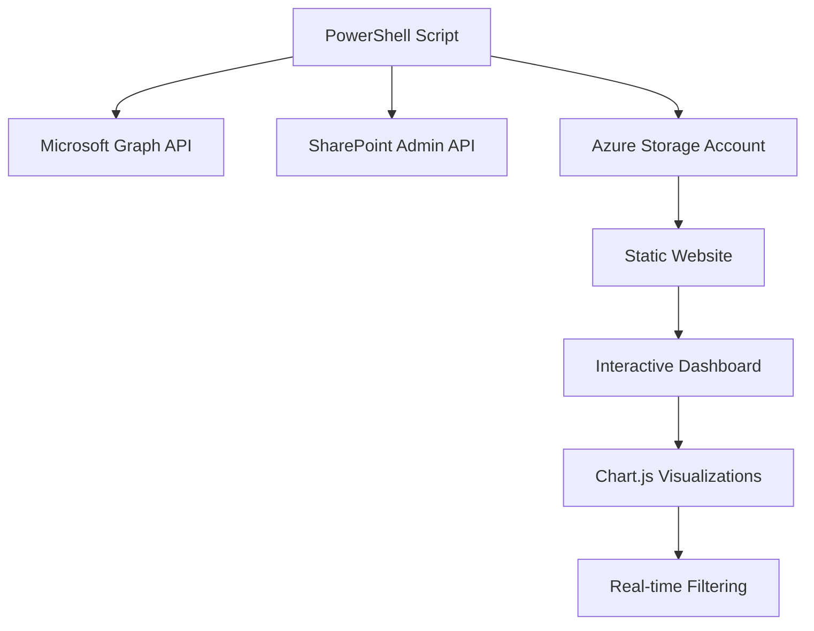
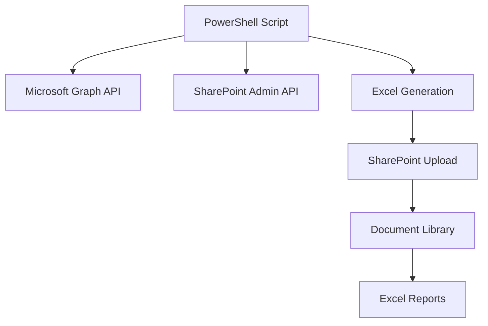

# Implementation Comparison: Azure Storage vs SharePoint Upload

This document compares the two implementation approaches for SharePoint download monitoring, helping you choose the right solution for your organization.

## 🏗️ Architecture Comparison

### Azure Storage + Interactive Dashboard


### SharePoint Upload + Excel Reports


## 📊 Feature Comparison

| Feature | Azure Storage | SharePoint Upload |
|---------|---------------|-------------------|
| **User Interface** | Modern web dashboard | Traditional Excel files |
| **Real-time Updates** | ✅ Live refresh | ❌ Manual file opening |
| **Interactive Filtering** | ✅ Advanced filters | ❌ Excel filtering only |
| **Mobile Friendly** | ✅ Responsive design | ❌ Excel mobile limitations |
| **Data Visualization** | ✅ Charts and graphs | ❌ Raw data only |
| **Dark Mode** | ✅ Theme switching | ❌ Excel default only |
| **Data Export** | ✅ Filtered CSV export | ✅ Native Excel format |
| **Offline Access** | ❌ Requires internet | ✅ Download and work offline |
| **Familiar Format** | ❌ New interface | ✅ Everyone knows Excel |
| **SharePoint Integration** | ❌ External dashboard | ✅ Native SharePoint storage |

## 🔧 Technical Comparison

### PowerShell Module Requirements

**Azure Storage Approach:**
```powershell
# Uses latest stable versions - flexible and modern
Install-Module ExchangeOnlineManagement  # Latest version
Install-Module Microsoft.Graph.Authentication  # Latest version
Install-Module Az.Storage  # Latest version
```

**SharePoint Upload Approach:**
```powershell
# Requires specific versions for reliability
Install-Module ExchangeOnlineManagement -RequiredVersion 3.5.0
Install-Module Microsoft.Graph.Authentication -RequiredVersion 2.25.0
Install-Module ImportExcel  # Latest version
```

### Authentication Methods

**Azure Storage:**
- ✅ Modern authentication patterns
- ✅ Managed Identity support
- ✅ Service Principal with secrets or certificates
- ✅ Interactive authentication for development

**SharePoint Upload:**
- ✅ Certificate-based authentication (recommended)
- ✅ Azure Automation Account integration
- ✅ Service Principal authentication
- ⚠️ Specific module version dependencies

### Deployment Complexity

**Azure Storage:**
```bash
# One-click deployment
az deployment group create \
  --resource-group rg-sharepoint-monitoring \
  --template-file deployment/azuredeploy.json
```

**SharePoint Upload:**
```powershell
# Manual Azure Automation setup required
1. Create Automation Account
2. Install specific module versions
3. Configure variables and certificates
4. Upload and schedule runbook
```

## 🎯 Use Case Recommendations

### Choose Azure Storage When:

✅ **Modern Analytics Required**
- Need interactive dashboards and visualizations
- Want real-time data filtering and search
- Require mobile-friendly access
- Prefer modern web interfaces

✅ **Technical Flexibility Needed**
- Want to use latest PowerShell modules
- Need to customize dashboard functionality
- Require API access to data
- Plan to integrate with other systems

✅ **Scalability Important**
- Large amounts of historical data
- High-frequency reporting needs
- Multiple users accessing concurrently
- Need for performance optimization

### Choose SharePoint Upload When:

✅ **Traditional Reporting Preferred**
- Users are comfortable with Excel
- Need offline data analysis capabilities
- Require familiar spreadsheet functions
- Want native SharePoint integration

✅ **Azure Automation Environment**
- Already using Azure Automation for other tasks
- Need reliable scheduled execution
- Have established certificate management
- Prefer runbook-based solutions

✅ **Compliance and Governance**
- Need reports stored in SharePoint for governance
- Require document library permissions and versioning
- Want native Office 365 integration
- Need audit trails for report access

## 💰 Cost Comparison

### Azure Storage Costs
- **Storage Account**: ~$2-5/month for small datasets
- **Static Website Hosting**: Included with storage
- **Data Transfer**: Minimal for dashboard access
- **Total Monthly**: ~$2-10 depending on usage

### SharePoint Upload Costs
- **Azure Automation**: ~$5-15/month for runbook execution
- **SharePoint Storage**: Included in M365 license
- **Certificate Management**: Minimal
- **Total Monthly**: ~$5-20 depending on frequency

## 🚀 Migration Path

### From SharePoint Upload to Azure Storage

1. **Keep existing runbook** for parallel operation
2. **Deploy Azure Storage** infrastructure
3. **Test dashboard** with same data
4. **Gradually transition users** to new dashboard
5. **Retire SharePoint upload** when confident

### From Azure Storage to SharePoint Upload

1. **Set up Azure Automation** account
2. **Install required module versions**
3. **Configure certificates and variables**
4. **Test runbook execution**
5. **Schedule regular uploads**

## 🔍 Decision Matrix

Rate each factor (1-5 scale) based on your organization's needs:

| Factor | Weight | Azure Storage Score | SharePoint Upload Score |
|--------|--------|-------------------|----------------------|
| User Experience | High | 5 | 3 |
| Technical Simplicity | Medium | 4 | 2 |
| Deployment Speed | Medium | 5 | 2 |
| Maintenance Overhead | High | 4 | 3 |
| Integration with M365 | Medium | 3 | 5 |
| Data Analysis Capabilities | High | 5 | 3 |
| Mobile Access | Medium | 5 | 2 |
| Offline Capabilities | Low | 1 | 5 |
| **Weighted Total** | | **4.2** | **3.1** |

## 📈 Future Roadmap

### Azure Storage Enhancements
- [ ] Power BI integration templates
- [ ] Advanced analytics with AI insights
- [ ] Real-time streaming data updates
- [ ] Multi-tenant dashboard support

### SharePoint Upload Enhancements
- [ ] Power Automate integration
- [ ] Enhanced Excel templates with pivot tables
- [ ] Automated email notifications
- [ ] Custom SharePoint web parts

## 🎯 Final Recommendation

**For Most Organizations: Choose Azure Storage Approach**
- Modern, user-friendly interface
- Better scalability and performance
- Easier maintenance and updates
- Future-proof architecture

**For Traditional Environments: Choose SharePoint Upload**
- Familiar Excel-based workflow
- Native M365 integration
- Proven Azure Automation reliability
- Minimal user training required

**Hybrid Approach**: Consider running both initially to compare user adoption and satisfaction, then standardize on the preferred method.

---

## 📝 Implementation Notes

Both solutions are fully functional and tested. The choice depends on your:
- User preferences and technical comfort level
- Existing infrastructure and processes
- Long-term strategic direction
- Maintenance capabilities and resources

**Remember**: You can always start with one approach and migrate to the other as your needs evolve!